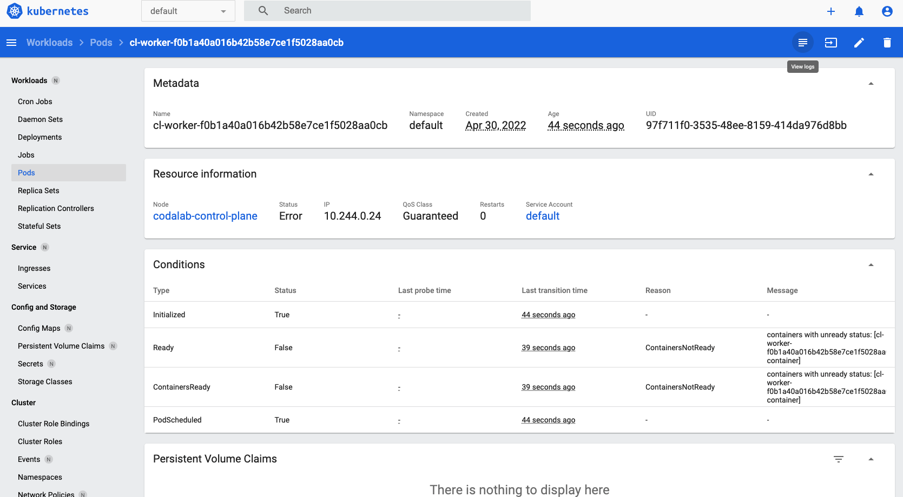

## Start a local Kubernetes Batch Worker Manager (with kind, for testing / development only)

If you want to test or develop with kubernetes locally, follow these steps to do so:

### Initial (one-time) setup

```
# First, start codalab without a worker:
codalab-service start -bds default no-worker

# Install initial dependencies
wget https://go.dev/dl/go1.18.1.linux-amd64.tar.gz && rm -rf /usr/local/go && sudo tar -C /usr/local -xzf go1.18.1.linux-amd64.tar.gz && rm go1.18.1.linux-amd64.tar.gz # Install go: instructions from https://go.dev/doc/install
export PATH=$PATH:/usr/local/go/bin:~/go/bin # add to your bash profile
go version # go should be installed
go install sigs.k8s.io/kind@v0.12.0
go install github.com/cloudflare/cfssl/cmd/...@latest
kind version # kind should be installed
cfssl version # cfssl should be installed

# Set up local kind cluster.
./scripts/local-k8s/setup.sh
# Set up web dashboard.
kubectl config use-context kind-codalab # makes sure kubectl is connected to local cluster
kubectl -n kubernetes-dashboard get secret $(kubectl -n kubernetes-dashboard get sa/admin-user -o jsonpath="{.secrets[0].name}") -o go-template="{{.data.token | base64decode}}" # copy this token and use it for web ui auth in the next step
# To view the dashboard, run \"kubectl proxy\" in a terminal and open up: http://localhost:8001/api/v1/namespaces/kubernetes-dashboard/services/https:kubernetes-dashboard:/proxy/#/workloads?namespace=default"
```

If all is successful, you should be able to log into your dashboard. You should have one node running (codalab-control-plane). After you follow the steps below, you should also be able to view each pod (which corresponds to each worker) and then check their logs by clicking on the icon in the top-right.



### Build worker docker image

You should repeat this step each time you change the worker docker image and want the local kind cluster to load it:

```bash
codalab-service build -s worker && kind load docker-image codalab/worker:k8s_runtime --name codalab # replace k8s-runtime with your branch name (replace - with _)
```

### Run codalab and worker managers

Run:

```
export CODALAB_SERVER=http://nginx
export CODALAB_WORKER_MANAGER_CPU_KUBERNETES_CLUSTER_HOST=https://codalab-control-plane:6443
export CODALAB_WORKER_MANAGER_TYPE=kubernetes
export CODALAB_WORKER_MANAGER_CPU_KUBERNETES_CERT_PATH=/dev/null
export CODALAB_WORKER_MANAGER_CPU_KUBERNETES_AUTH_TOKEN=/dev/null
export CODALAB_WORKER_MANAGER_CPU_DEFAULT_CPUS=1
export CODALAB_WORKER_MANAGER_CPU_DEFAULT_MEMORY_MB=100
export CODALAB_WORKER_MANAGER_MIN_CPU_WORKERS=0
export CODALAB_WORKER_MANAGER_MAX_CPU_WORKERS=1
codalab-service start -bds default no-worker worker-manager-cpu
```

Or if you just want to run the worker manager and check its logs, run:
```
codalab-service start -bds worker-manager-cpu && docker logs codalab_kubernetes-worker-manager-cpu_1 --follow
```

### Teardown

You can remove the kind cluster by running:

```
kind delete cluster --name codalab
```

### Todo

todos for this PR:
- get GPUs to work
- make sure workers are now advertising their number of CPUs / disk space properly
- make sure time calculations for bundles work

future todos:
- ssl / auth for local k8s
- (lower priority) eventually use persistentvolumes for multiple workers, see https://stackoverflow.com/questions/31693529/how-to-share-storage-between-kubernetes-pods
